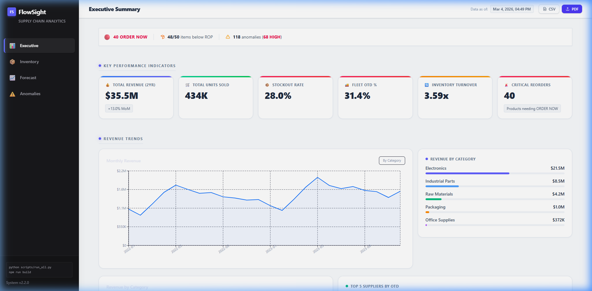
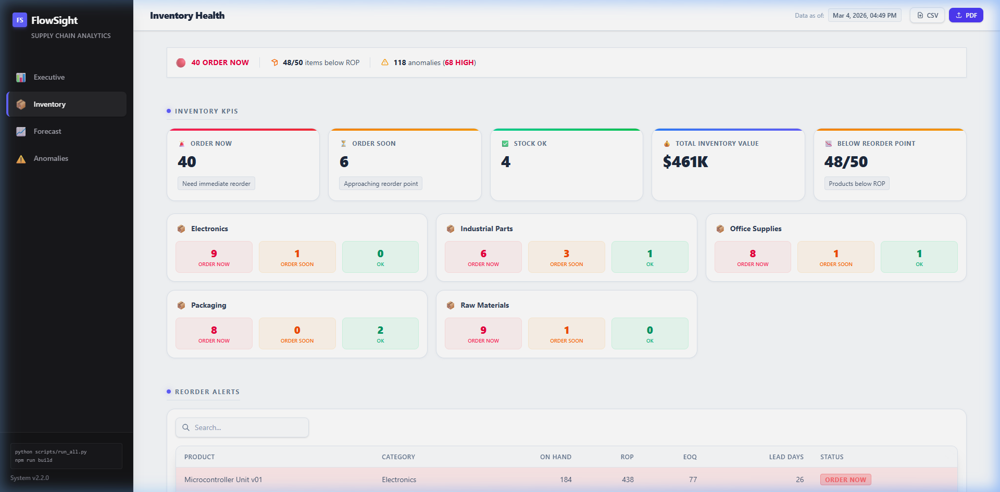
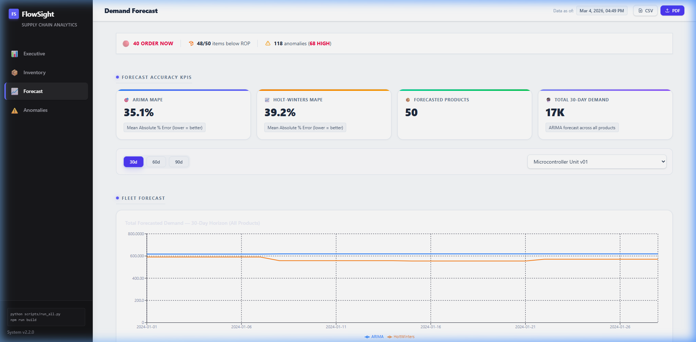
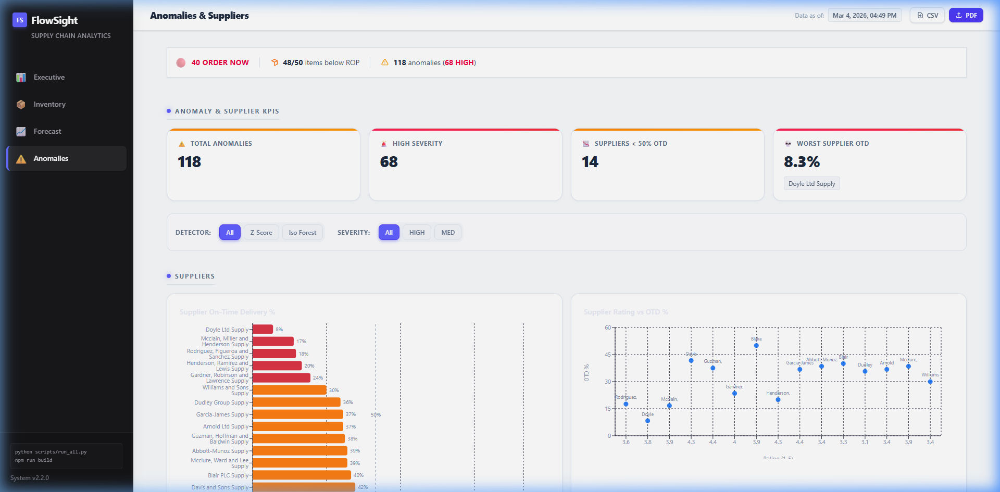

# FlowSight — Supply Chain Intelligence Platform

A portfolio-grade supply chain analytics system built with SQL, Python, and Power BI.
Demonstrates enterprise-level data engineering, time-series forecasting, anomaly detection,
and executive dashboard design — comparable in concept to SAP analytics layers.

---

## Architecture

```
Python Data Generators (synthetic, realistic)
        |
        v 
ETL Pipeline (transform -> validate -> load)
        |
        v
SQLite Database  (flowsight.db)
  7 core tables + 4 analytics tables + 8 Power BI views
        |
        v
Python Analytics Engine
  KPIs | ARIMA + Holt-Winters Forecasting | EOQ/ROP | Anomaly Detection
        |
        v
Power BI Desktop (ODBC Import Mode)
  4 Dashboard Pages: Executive | Inventory | Forecast | Anomalies
```

---

## Quickstart

### 1. Install dependencies

```bash
pip install pandas numpy faker sqlalchemy python-dotenv \
            statsmodels scikit-learn matplotlib scipy plotly pytest
```

### 2. Run everything

```bash
# From project root
python scripts/run_all.py
```

This single command runs all three phases in sequence (~30-60 seconds):
- **Phase 1**: Generates synthetic data, loads 7 tables + 8 views into SQLite
- **Phase 2**: Runs ARIMA + Holt-Winters forecasts, evaluates accuracy
- **Phase 3**: Computes EOQ/ROP recommendations, detects anomalies, fires alert rules

### 3. Run individual phases

```bash
python scripts/run_all.py --phase 1   # ETL only
python scripts/run_all.py --phase 2   # ETL + forecasting
python scripts/run_all.py --phase 3   # full (default)
```

### 4. Run tests

```bash
python -m pytest tests/ -v
```

---

## Database Schema

### Core Tables (7)

| Table | Rows | Description |
|-------|------|-------------|
| Products | 50 | SKUs across 5 categories with cost, price, lead time |
| Suppliers | 15 | Vendors with country, lead time, rating |
| Inventory | 50 | Current stock levels and reorder points |
| Orders | ~300 | Purchase orders over 2 years |
| OrderItems | ~1,400 | Line items per order |
| Sales | ~25,000 | Daily sales with seasonality + trend |
| Shipments | ~200 | Delivery records with delay calculation |

### Analytics Tables (4)

| Table | Description |
|-------|-------------|
| Forecasts | ARIMA + Holt-Winters demand forecasts (30/60/90 day horizons) |
| ForecastEvaluation | Walk-forward backtest MAE/RMSE/MAPE per model |
| Recommendations | EOQ + ROP per product |
| Anomalies | Z-score + Isolation Forest flagged events |

### Power BI Views (8)

| View | Used in |
|------|---------|
| vw_kpi_inventory_turnover | Inventory dashboard |
| vw_kpi_stockout | Inventory dashboard |
| vw_supplier_performance | Supplier dashboard |
| vw_demand_forecast | Forecast dashboard |
| vw_reorder_alerts | Inventory + Executive |
| vw_eoq_recommendations | Inventory dashboard |
| vw_anomaly_summary | Anomaly dashboard |
| vw_sales_trend | Executive + Forecast |

---

## Analytics Modules

### KPIs (`analytics/kpis/`)
- **Inventory Turnover**: COGS / Avg Inventory Value by product + month
- **Stockout Rate**: % of products below safety stock or reorder point
- **Supplier OTD**: On-time delivery % + monthly trend per supplier
- **Delay Analysis**: Mean, P75, P90, P99 delay days per supplier

### Forecasting (`analytics/forecasting/`)
- **ARIMA(1,1,1)**: Fitted on weekly aggregates via `statsmodels`
- **Holt-Winters**: Triple exponential smoothing (trend + seasonal fallback)
- **Evaluator**: Walk-forward backtest with 90-day holdout, reports MAE/RMSE/MAPE
- Generates 30 / 60 / 90 day forward forecasts per product

### Optimization (`analytics/optimization/`)
- **EOQ**: `sqrt(2 * D * S / H)` — optimal order quantity per product
- **ROP**: `AvgDailyDemand * LeadTime + Z * StdDev * sqrt(LeadTime)` (Z=1.645, 95% SL)
- Results written to `Recommendations` table and surfaced in `vw_reorder_alerts`

### Anomaly Detection (`analytics/anomaly/`)
- **Z-score**: Rolling 30-day window, flags |z| > 3.0 on daily QuantitySold
- **Isolation Forest**: Multi-feature (units sold, revenue, delay, turnover), flags top 5%
- Results written to `Anomalies` table with severity: LOW / MEDIUM / HIGH

### Alerts (`alerts/`)
- **Rule engine**: 4 rules — stockout risk, order-now trigger, high anomaly, supplier delay spike
- **Email sender**: HTML digest via SMTP SSL (set credentials in `.env`)

---

## Power BI Connection

1. Install the [SQLite ODBC Driver](http://www.ch-werner.de/sqliteodbc/)
2. Create a DSN: Control Panel > ODBC > System DSN > Add > SQLite3 ODBC Driver
   - Set Database to the full path of `db/flowsight.db`
3. In Power BI Desktop: Get Data > ODBC > select your DSN
4. Import all 8 `vw_*` views — use **Import Mode** (not DirectQuery)
5. Refresh: re-run `python scripts/run_all.py` then reopen Power BI

### Recommended Dashboard Pages

| Page | Key Visuals |
|------|-------------|
| Executive Summary | Revenue trend, Category breakdown, Supplier OTD rankings, KPI cards |
| Inventory Health | Category alert matrix, Reorder alerts table, Turnover heatmap, EOQ recommendations |
| Demand Forecast | ARIMA vs HoltWinters ribbon chart, Confidence bands, 30/60/90d horizon toggle |
| Anomalies & Suppliers | Supplier OTD bar, Anomaly scatter/heatmap, Isolation Forest vs Z-Score |

### Dashboard UI (v2.2 — Light Mode + Export)

The React dashboard features a modern enterprise design with:
- 🌞 **Clean light mode** with contrasting dark sidebar
- 📱 **Fully mobile-responsive** — collapsible sidebar on small screens
- 📥 **CSV Export** — one-click data download for any active page
- 📄 **PDF Export** — branded PDF report with FlowSight header, timestamp, and page content
- 🔄 **Live filters** — horizon toggles, severity/detector filter pills, searchable tables

#### Executive Summary


#### Inventory Health — Category Alert Matrix


#### Demand Forecast — ARIMA & Holt-Winters


#### Anomalies & Suppliers


---

## Email Alerts Setup

Create a `.env` file in the project root:

```
SMTP_HOST=smtp.gmail.com
SMTP_PORT=465
SMTP_USER=your.email@gmail.com
SMTP_PASSWORD=your_app_password
ALERT_EMAIL_FROM=your.email@gmail.com
ALERT_EMAIL_TO=ops@yourcompany.com
```

Then run:
```bash
python -m alerts.email_sender --dry-run   # preview HTML
python -m alerts.email_sender             # send
```

---

## Project Structure

```
.
+-- config/settings.py          Central config (DB path, seeds, thresholds)
+-- data/
|   +-- generate_data.py        Master data generator
|   +-- generators/             6 generator modules (products, suppliers, ...)
+-- db/
|   +-- schema.sql              All CREATE TABLE statements (source of truth)
|   +-- views.sql               8 Power BI views
|   +-- db_init.py              Creates database
|   +-- db_loader.py            Bulk insert DataFrames
+-- etl/
|   +-- pipeline.py             Orchestrator (run this for Phase 1)
|   +-- transformers.py         Derived column computation
|   +-- validators.py           FK + null + range checks
+-- analytics/
|   +-- kpis/                   4 KPI modules
|   +-- forecasting/            4 forecasting modules (ARIMA, HoltWinters, evaluator, writer)
|   +-- optimization/           3 optimization modules (EOQ, ROP, writer)
|   +-- anomaly/                3 anomaly modules (zscore, isoforest, writer)
+-- alerts/
|   +-- alert_rules.py          4-rule alert engine
|   +-- email_sender.py         HTML email digest via SMTP
+-- tests/                      5 pytest test files
+-- scripts/
|   +-- run_all.py              Master runner (all phases)
+-- requirements.txt
+-- README.md
```

---

## Key Design Decisions

| Decision | Rationale |
|----------|-----------|
| SQLite over PostgreSQL | Zero-install, Power BI ODBC Import works natively |
| Synthetic data with Fourier seasonality | Produces realistic Q4 peaks, weekly patterns for forecasting |
| ARIMA + Holt-Winters over Prophet | Prophet incompatible with Windows path limits; statsmodels is pure Python |
| Weekly aggregation for forecasting | Reduces noise, speeds fitting, more stable than daily ARIMA |
| EOQ with Z-factor safety stock | Statistically principled vs simple rule-of-thumb |
| Isolation Forest (multi-feature) + Z-score (univariate) | Complementary detectors catch different anomaly types |

---

## Skills Demonstrated

- **SQL**: Normalized schema design, FK constraints, indexes, analytical views
- **ETL**: Validation pipeline, FK-safe load order, idempotent re-runs
- **Time-series forecasting**: ARIMA, exponential smoothing, walk-forward backtesting, MAPE
- **Inventory analytics**: EOQ, ROP with service-level Z-factor, stockout rate
- **Anomaly detection**: Z-score (univariate), Isolation Forest (multivariate)
- **Supply chain KPIs**: Inventory turnover, OTD%, delay distribution
- **Software engineering**: Modular architecture, pytest suite, CLI runner, config separation
